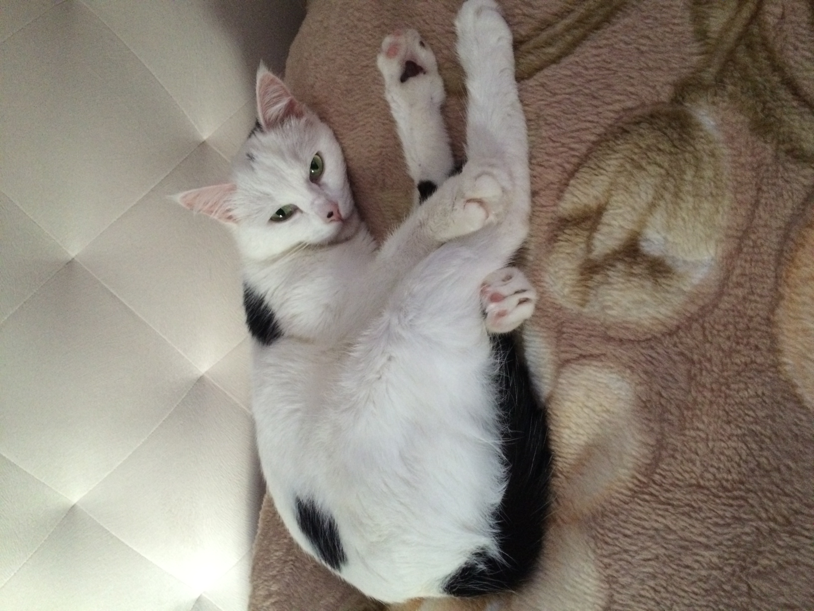

# Р Е З Ю М Е

## Дробышева Екатерина Юрьевна

### Личная информация
Дата рождения:	__.__.1986 г.  
Адрес:	г. Москва  
Телефон:	8(925) 000-00-00  
E-Mail:	katerina  
Семейное положение:	Не замужем, детей нет.  
Образование:	высшее,
квалификация: Инженер,
специальность: «Радиосвязь, радиовещание и телевидение».

### Интересующая позиция:
Инженер 1 категории Отдела по работе с заявителями

### Опыт работы:
Период работы:	август 2008 г. – по июнь 2013 г.  
Место работы:	ГАС   
Должность:	Главный специалист отдела  

## Образование:
### Основное:
Учебное заведение:	КГТУ им. И.Раззакова  
Срок обучения:	2003-2008 гг.  
Диплом:	Присвоена квалификация Инженер по специальности «Радиосвязь, радиовещание и телевидение»  
### Повышение квалификации (курсы):
Наименование курса:	«Государственное регулирование внедрения цифрового телевидения»  
Учебное заведение:	Бюро развития электросвязи МСЭ совместно с Казахской Академией Инфокоммуникаций  
Удостоверение:	Сертификат  
Наименование курса:	«Управление программами и проектами развития»
Учебное заведение:	Академия Государственного Управления при Президенте Кыргызской Республики  
Удостоверение:	Сертификат  

### Дополнительная информация:
Условия работы:	Полная занятость, возможные командировки  
Деловые качества:	Требовательна к себе и окружающим, предана своим профессиональным обязанностям, стремлюсь к организации четкого и сбалансированного производственного процесса  
Личные качества:	Исполнительна, коммуникабельна, пунктуальна, обучаема, вредных привычек нет.  
Рекомендация:	По требованию

